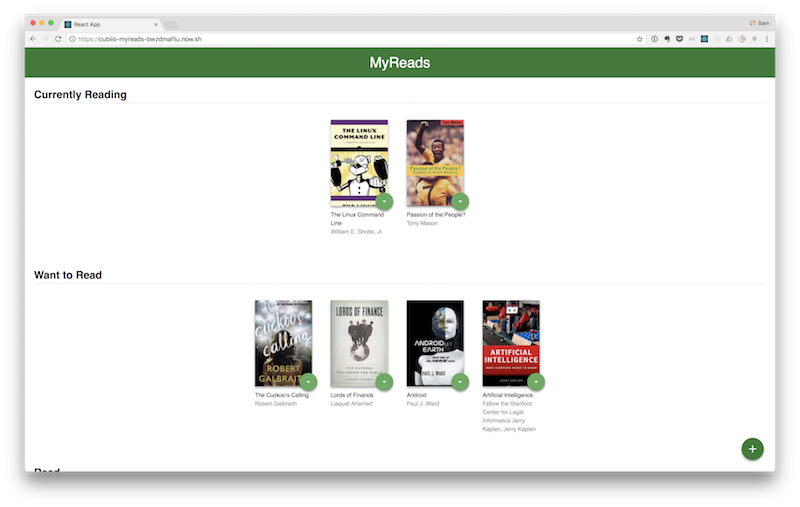

# React Project: MyReads

[](https://github.com/ellerbrock/typescript-badges/)
[](https://github.com/prettier/prettier)
[](https://github.com/facebook/jest)
[](https://travis-ci.org/cubiio/reactnd-myreads)

## Description
This is the first project for the [React Nanodegree](https://www.udacity.com/course/react-nanodegree--nd019).

## Table of Contents

- [Getting started](#getting-started)
  - [Installation](#installation)
- [Develop](#develop)
  - [How to run](#how-to-run)
  - [Backend Server API](#backend-server-api)
  - [Tests](#tests)
  - [Continuous Integration](#continuous-integration)
  - [Style Guide](#style-guide)
- [Release](#release)
  - [Build](#build)
  - [Deploy](#deploy)
  - [Demo](#demo)


## Getting started

### Installation

This project was bootstrapped with [Create React App](https://github.com/facebookincubator/create-react-app).

**Dependencies:**

* Yarn package manager
* `create-react-app`
* Editor / IDE

To get started with this repository:

```sh
# git clone the repository e.g. into a <projects> folder
cd <projects>
# git clone with ssh
git clone git@github.com:cubiio/reactnd-myreads.git
# or git clone with HTTPS
git clone https://github.com/cubiio/reactnd-myreads.git

# change directory into the cloned repo
cd myreads

# install the dependencies
yarn
```

## Develop

### How to run

```sh
# Navigate into your local myreads project directory
cd <projects>/myreads

# To run the development server
yarn start
```

If there appears to be issues with dependencies not being installed, or up to date, then run `yarn`.

### Backend Server API

**Instructions from Udacity on how to use the API:**

To simplify your development process, we've provided a backend server for you to develop against. The provided file [`BooksAPI.js`](src/BooksAPI.js) contains the methods you will need to perform necessary operations on the backend:

* [`getAll`](#getall)
* [`update`](#update)
* [`search`](#search)

#### `getAll`

Method Signature:

```js
getAll()
```

* Returns a Promise which resolves to a JSON object containing a collection of book objects.
* This collection represents the books currently in the bookshelves in your app.

#### `update`

Method Signature:

```js
update(book, shelf)
```

* book: `<Object>` containing at minimum an `id` attribute
* shelf: `<String>` contains one of ["wantToRead", "currentlyReading", "read"]
* Returns a Promise which resolves to a JSON object containing the response data of the POST request

#### `search`

Method Signature:

```js
search(query, maxResults)
```

* query: `<String>`
* maxResults: `<Integer>` Due to the nature of the backend server, search results are capped at 20, even if this is set higher.
* Returns a Promise which resolves to a JSON object containing a collection of book objects.
* These books do not know which shelf they are on. They are raw results only. You'll need to make sure that books have the correct state while on the search page.

#### Search Terms
The backend API uses a fixed set of cached search results and is limited to a particular set of search terms (see Search Terms below). That list of terms are the _only_ terms that will work with the backend, so don't be surprised if your searches for Basket Weaving or Bubble Wrap don't come back with any results.

'Android', 'Art', 'Artificial Intelligence', 'Astronomy', 'Austen', 'Baseball', 'Basketball', 'Bhagat', 'Biography', 'Brief', 'Business', 'Camus', 'Cervantes', 'Christie', 'Classics', 'Comics', 'Cook', 'Cricket', 'Cycling', 'Desai', 'Design', 'Development', 'Digital Marketing', 'Drama', 'Drawing', 'Dumas', 'Education', 'Everything', 'Fantasy', 'Film', 'Finance', 'First', 'Fitness', 'Football', 'Future', 'Games', 'Gandhi', 'Homer', 'Horror', 'Hugo', 'Ibsen', 'Journey', 'Kafka', 'King', 'Lahiri', 'Larsson', 'Learn', 'Literary Fiction', 'Make', 'Manage', 'Marquez', 'Money', 'Mystery', 'Negotiate', 'Painting', 'Philosophy', 'Photography', 'Poetry', 'Production', 'Programming', 'React', 'Redux', 'River', 'Robotics', 'Rowling', 'Satire', 'Science Fiction', 'Shakespeare', 'Singh', 'Swimming', 'Tale', 'Thrun', 'Time', 'Tolstoy', 'Travel', 'Ultimate', 'Virtual Reality', 'Web Development', 'iOS'

### Tests

[Jest](https://facebook.github.io/jest/) is used for tests. To run the test suite, use this command:

```sh
yarn test
```

### Continuous Integration
It's _complete_ overkill for this project but I added Travis CI to the project. A commit pushed to `origin/<branch>` triggers a build on [Travis](https://travis-ci.org/).

The `.travis.yml` file includes the CI build config. The `.nvmrc` file is used to specify the version of Node used in the project and for the CI build.

### Style Guide
This repo uses [ESLint](https://eslint.org/) with [Prettier](https://github.com/prettier/prettier) formatting.

The ESLint config extends from AirBnB, with a few changes. Refer to the `.eslintrc.yml` file in the root of the repo for info on the changes.

## Release

### Build

```sh
# from the project root:
yarn build
```

### Deploy

The demo app is deployed with [Now](https://zeit.co/download). These are the instructions to deploy with `now`.

```sh
# from the project root:
yarn build

cd build

now --name your-project-name

# for example:
now --name cubiio-myreads
> Ready! https://cubiio-myreads-rleglhnrla.now.sh/ (copied to clipboard) [6s]
```

Paste that URL into your browser when the build is complete, and you will see your deployed app.

### Demo

The demo app is currently live [here](https://cubiio-myreads-rleglhnrla.now.sh/).

#### Screenshots




